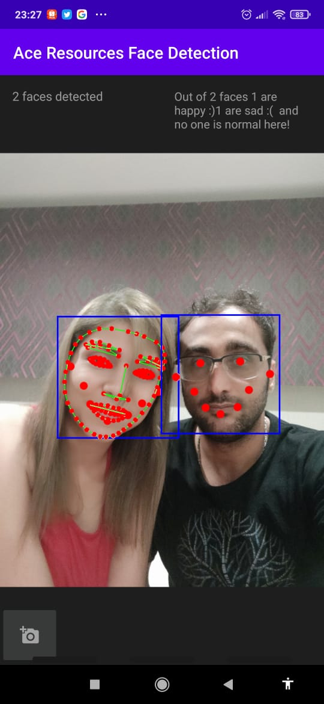

# 📱 Ace Test
Using 100% Open Source technologies, make a mobile app to take a picture, upload the
picture onto a cloud Computer Vision library to detect the number of human faces inside the
picture. Send response back to the mobile app with the number. Canbuild on Android, iOS,
can use React Native, Swift, Objective C++, Java, embedded web HTML5 or any other
framework

## Note
-  Presented codes are not optimized, since it is a demo it aims **simplicity**
-  Check out best practices that will be suitable to your project
-  this is built over the **asmaamircode** from github 

##  Known Bug
-  Face contour detection functionality can detect contours of an only single face in the image 
  - [Stack Overflow](https://stackoverflow.com/q/57203678)

## 🎴 Screenshots

	
	

